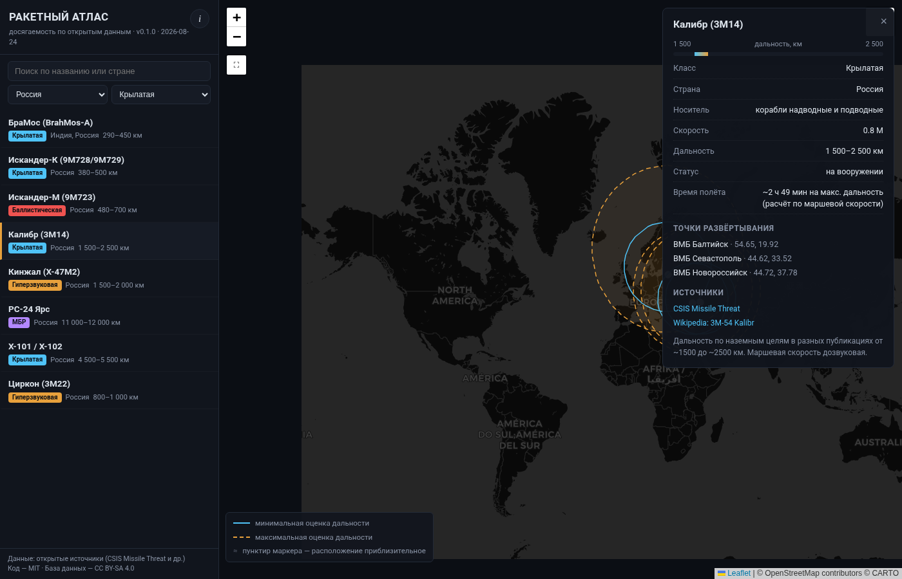

# Ракетный атлас

Интерактивный атлас досягаемости ракетных комплексов мира по **открытым данным**.
Выбираете систему — карта строит зоны досягаемости от известных точек развёртывания.
Есть режим построения колец от произвольной точки карты.

**Живая версия:** `https://<username>.github.io/rocket-atlas/` (после включения GitHub Pages)



## Что внутри

- 23 системы: крылатые, баллистические, гиперзвуковые, МБР
- Каждая дальность задана **интервалом** [min..max] км — разброс опубликованных оценок,
  а не одно «официальное» число
- Точки развёртывания с пометкой приблизительности (≈)
- Время подлёта: расчёт по маршевой скорости для крылатых, текстовые оценки для баллистических
- Карточка каждой системы со ссылками на источники

## Зачем

Новость о передислокации комплекса — абстракция, пока километры не превращаются в геометрию.
Атлас показывает масштаб: какие города и базы попадают в зону, а какие остаются вне её.
Проект образовательный: про географию и открытые данные, не про прогнозы и оценки.

## Насколько этому можно верить

С точностью открытых источников:

- крылатые ракеты — лучшие данные (±10% по дальности, время подлёта считается уверенно);
- баллистические малой/средней дальности — первое приближение;
- МБР — разведоценки с плавающей точностью;
- часть публичных ТТХ может быть искажена намеренно — поэтому интервалы, а не числа;
- мобильные комплексы показаны зонами базирования, а не позициями пуска.

Полная методология — в кнопке «i» в интерфейсе.

## Стек

Чистый HTML/CSS/JS без сборки. Leaflet 1.9 + тайлы CARTO/OpenStreetMap/Esri.
Данные — `data.js`, обычный JS-объект. Работает открытием файла двойным кликом,
деплой на GitHub Pages — статика из корня репозитория.

## Запуск локально

```bash
git clone https://github.com/<username>/rocket-atlas.git
cd rocket-atlas
python3 -m http.server 8000   # или просто откройте index.html
```

## Как добавить систему

Пришлите PR или issue. Запись в `data.js`:

```js
{
  id: "my-system",
  name: "Название",
  country: "Страна",            // или массив для совместных разработок: ["A", "B"]
  klass: "Крылатая|Баллистическая|Гиперзвуковая|МБР",
  platform: "носитель",
  speed_mach: null, speed_kmh: null,
  range_km_min: 500, range_km_max: 700,
  status: "на вооружении",
  flight_note: "текстовая оценка времени полёта | null",
  notes: "комментарий",
  sources: [{label:"CSIS Missile Threat", url:"https://missilethreat.csis.org"}],
  deployments: [{name:"точка", lat:54.6, lon:21.0, approximate:false}]
}
```

Правила приёма: указаны источники; дальность — интервалом по расхождениям публикаций;
координаты только из публично документированных мест.

## Лицензии

Код — MIT. База данных — CC BY-SA 4.0 с указанием исходных источников.
Тайлы © OpenStreetMap contributors, © CARTO, © Esri.
Проект некоммерческий и образовательный.
